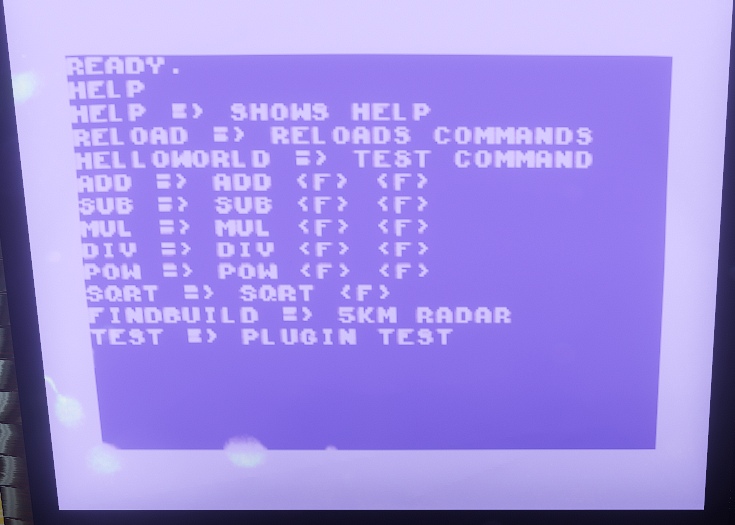

# Advanced Computer Mod

The Advanced Computer Mod is a small mod that extends the computer (the c64) with a few practical functions and an API.
The functions currently include a few calculation functions and a radar that shows the distance and direction to the next building.
The API, on the other hand, makes it possible for other modders to simply add further functions to the computer or to use the C64 for their mod.

## Getting Started
- [Mod Installation](https://github.com/BoettcherDasOriginal/TLD_AdvancedComputerMod/wiki/Mod-Installation)
- [API Documentation](https://github.com/BoettcherDasOriginal/TLD_AdvancedComputerMod/wiki/API-Documentation)

## Screenshots

